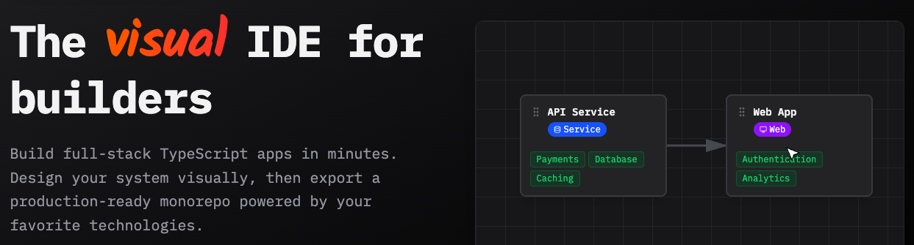

<h1>FounderOS</h1>
  
  <a href="https://founderos.xyz">founderos.xyz</a>
  

    <a href="#quick-start">Quick Start</a> •
    <a href="#features">Features</a> •
    <a href="#architecture">Architecture</a> •
    <a href="#tech-stack">Tech Stack</a> •
    <a href="#contributing">Contributing</a>
  

---

## Project Status

**FounderOS is actively under development.** We're building in public and expect to release an alpha version if we receive enough interest.

Star this repo and check back regularly for updates!

## Overview

FounderOS is a visual builder and CLI that generates complete, production-ready TypeScript monorepos. Skip the boilerplate and focus on your product.

**What it does:**

- Visual canvas for designing services, APIs, and data models
- Generates typed tRPC endpoints, Prisma schemas, and Next.js frontends
- Drop-in modules for payments (Stripe), auth (Clerk/Auth.js), queues, caching
- Keeps your codebase in sync with templates you control
- All generated code is plain, readable TypeScript

**What it doesn't do:**

- Lock you into proprietary patterns or hidden abstractions
- Deploy your code (bring your own infrastructure)
- Replace your IDE (works alongside VS Code, Cursor, etc.)

### Try the Interactive Demo

The demo includes a visual canvas where you can:

- Drag and drop to create services and clients
- Connect components with typed SDKs
- Configure modules (auth, payments, analytics)
- See how the architecture flows

Visit [http://founderos.xyz/demo](http://founderos.xyz/demo)

## Features

### Visual Builder

Design your system architecture on an interactive canvas. Add services, databases, and integrations with a few clicks.

### TypeScript-First

All generated code is modern TypeScript. Uses tRPC for end-to-end type safety, Prisma for databases, and Next.js for frontends.

### Drop-in Modules

Pre-built, typed integrations for:

- **Payments**: Stripe with webhook handling
- **Auth**: Clerk or Auth.js with typed guards
- **Queues**: BullMQ for background jobs
- **Caching**: Redis integration
- **Analytics**: PostHog, Mixpanel

### Monorepo Structure

Generates a clean turborepo with:

- Shared types and utilities
- Service-specific packages
- Versioned SDK generation
- Unified tooling (ESLint, Prettier, TypeScript)

### Template-Driven

Your architecture lives as editable templates. Modify them to customize how code gets generated.

### No Lock-In

Generated code is yours. No proprietary runtime, no hidden magic. Eject anytime by just... not running the CLI again.

## License

[ISC License](LICENSE)

## Links

- **Website**: [founderos.xyz](https://founderos.xyz)
- **Demo**: [founderos.xyz/demo](https://founderos.xyz/demo)

  
A <a href="https://aquietlife.io">Quiet Life</a> product.

